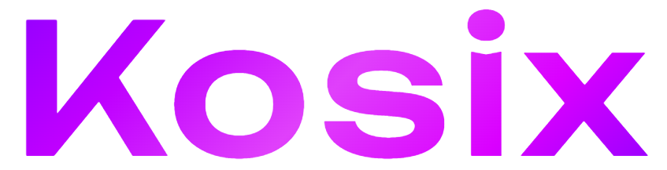

[](LICENSE)
[](https://www.python.org/)
[](https://github.com/google/genai-agent-dev-kit)
[](https://fastapi.tiangolo.com/)
[](https://nextjs.org/)

## Table of Contents

1. [Introduction](#introduction)
2. [Features](#features)
3. [Installation](#installation)
<!-- 4. [Usage](#usage) -->
4. [Contributing](#contributing)
<!-- 6. [License](#license)
5. [Acknowledgments](#acknowledgments) -->

## Introduction

**Kosix** is an AI-powered analytics platform that enables non-technical users to query databases using natural language and generate insights through automated SQL, charts, and reports. It combines multi-agent reasoning with a secure, no-code interface to turn complex data questions into actionable visual outputs. Designed for scalability and explainability, Kosix empowers teams to make data-driven decisions without writing a single line of code.



## Features

Kosix comes with a powerful set of features designed for modern data analytics:

- **Natural Language Queries**: Ask questions in plain English and get instant SQL translations.
- **Multi-Agent Architecture**: Leverages Google's Agent Development Kit (ADK) for intelligent query processing.
- **Automated Visualizations**: Generates charts and reports automatically from your data.
- **Secure & Scalable**: Built with FastAPI backend for high-performance and secure data handling.
- **No-Code Interface**: Intuitive UI powered by Next.js for seamless user experience.
- **Database Agnostic**: Connect to multiple database sources effortlessly.
- **Explainable AI**: Understand how queries are generated with transparent reasoning.
- **Real-time Insights**: Get instant feedback and results from your data queries.

## Installation

To start using Kosix, follow these installation steps:

### 1. Clone the Repository

```bash
git clone https://github.com/DevyManish/kosix-backend
cd kosix-backend
```

### 2. Environment Configuration

Create a `.env` file in the root directory based on the `.env.sample` file:

```env
OPENAI_API_KEY=

SERVER_HOST=localhost

SERVER_PORT=8080
```

For creating API_KEY visit [Google AI Studio](https://aistudio.google.com/)

### 3. Install Dependencies

Sync the project dependencies using `uv`:

```bash
uv sync
```

### 4. Running the Application

You can run the server and ADK commands manually by navigating to their respective directories.

**To run the Server:**

```bash
cd server
uv run python main.py
```

**To run ADK:**

```bash
cd agents
uv run adk [args...]
```

### Contributors

[](https://github.com/DevyManish/kosix-backend/graphs/contributors)

---