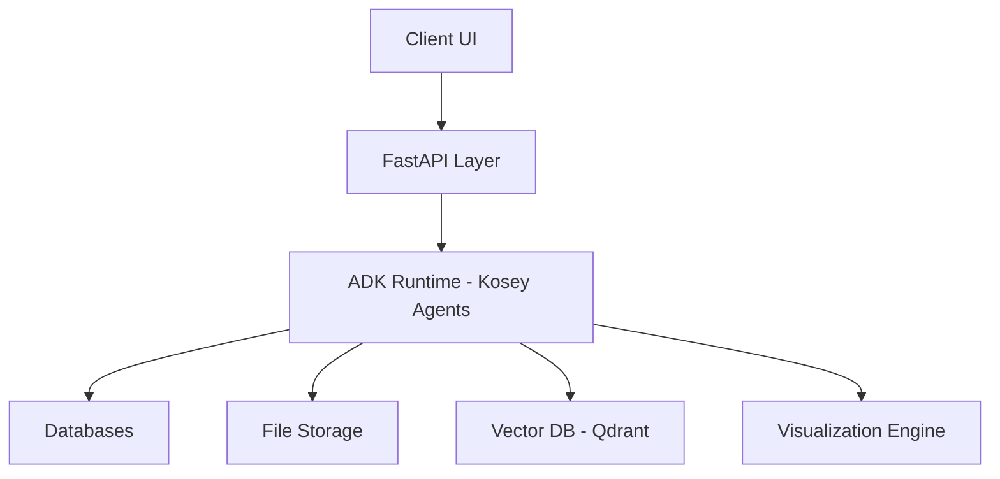
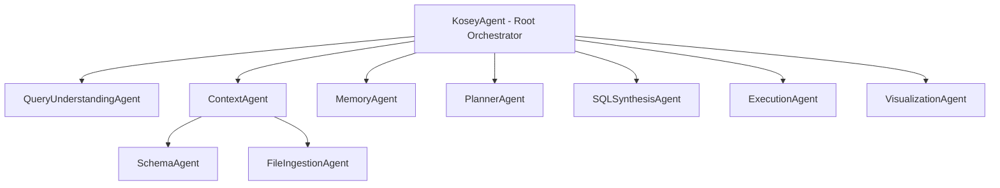
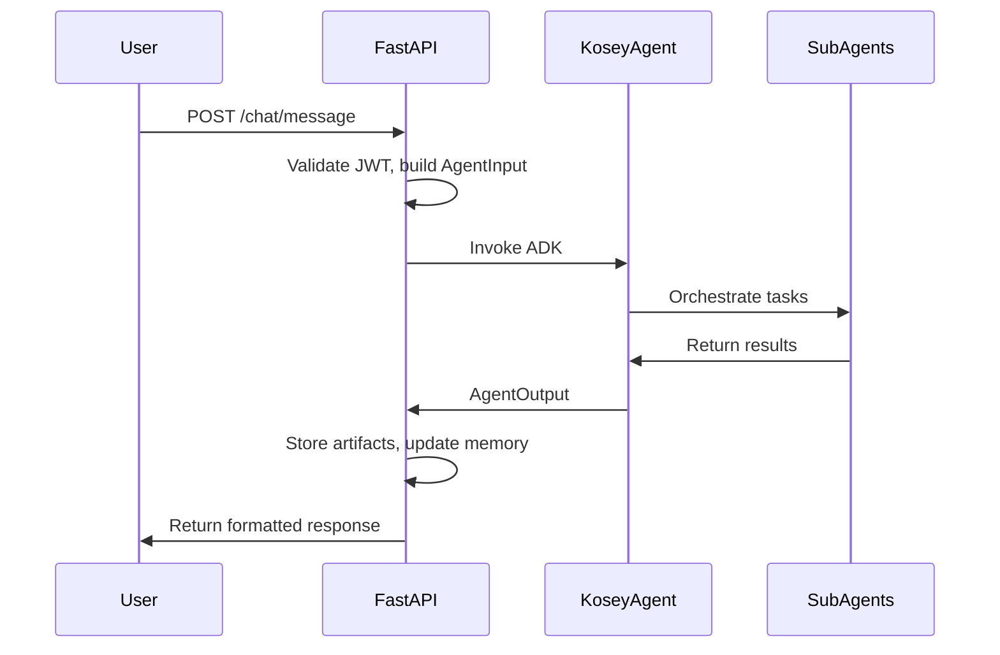

# Kosey: Agentic No-Code SQL Expert Platform - System Design Documentation

---

## Table of Contents
1. [Vision & Goals](#vision--goals)
2. [High-Level Architecture](#high-level-architecture)
3. [Agentic System Design (ADK)](#agentic-system-design-adk)
   - [Agent Hierarchy](#agent-hierarchy)
   - [Agent Responsibilities & Contracts](#agent-responsibilities--contracts)
   - [Tooling Summary](#tooling-summary)
4. [FastAPI Wrapper Design](#fastapi-wrapper-design)
   - [Responsibilities](#responsibilities)
   - [Request Lifecycle](#request-lifecycle)
   - [API Surface](#api-surface)
5. [Security & Multi-Tenancy](#security--multi-tenancy)
6. [Observability](#observability)
7. [Project Structure](#project-structure)
8. [Non-Negotiable Design Rules](#non-negotiable-design-rules)
9. [Next Steps](#next-steps)

---

## 1. Vision & Goals

**Kosey** is an **agentic, no-code SQL expert system** that enables users to interact with databases and uploaded files using natural language.

### Core Capabilities:
- Understands user intent from text and files (PDF, CSV, Excel)
- Discovers database schemas and context
- Generates safe, read-only SQL
- Executes queries securely
- Returns results in human-consumable formats (tables, charts, reports)
- Maintains long-term knowledge via a Knowledge Base (KB)

### Design Principles:
- Multi-tenancy support
- Security-first execution
- Explainability and transparency
- Extensibility and scalability

---

## 2. High-Level Architecture



**Key Principle:**  
FastAPI is a **thin IO & orchestration layer**. All reasoning and intelligence reside within the ADK agent system.

---

## 3. Agentic System Design (ADK)

### 3.1 Agent Hierarchy



**Rules:**
- Only **KoseyAgent** communicates with FastAPI
- Sub-agents **never** talk directly to each other
- All inter-agent communication uses **strict JSON**

### 3.2 Agent Responsibilities & Contracts

#### 3.2.1 KoseyAgent (Root Orchestrator)
**Role:** Planner, router, and execution supervisor

**Input:**
```json
{
    "session_id": "uuid",
    "user_id": "uuid",
    "org_id": "uuid",
    "conversation_id": "uuid",
    "message": "user prompt",
    "files": ["file_id"],
    "history": []
}
```

**Output:**
```json
{
    "status": "success | needs_clarification | error",
    "response_type": "table | chart | report | text",
    "data": {},
    "explanation": "human-readable summary",
    "confidence": 0.92
}
```

---

#### 3.2.2 QueryUnderstandingAgent
**Role:** Convert raw user input into structured intent

**Output:**
```json
{
    "intent": "analytics | reporting | exploration",
    "requires_sql": true,
    "requires_chart": true,
    "chart_type": "line | bar | pie | auto",
    "metrics": ["sales"],
    "dimensions": ["month"],
    "filters": [],
    "ambiguities": ["date range missing"]
}
```

**Caching:** Short-term (Redis/in-memory, 5-15 min TTL)

---

#### 3.2.3 ContextAgent (Composite)
**Role:** Provide data context

**Sub-agents:**
- **SchemaAgent:** Fetches database metadata
- **FileIngestionAgent:** Parses uploaded files into virtual tables (DuckDB)

**SchemaAgent Output:**
```json
{
    "tables": ["orders"],
    "columns": { "orders": ["order_date", "amount"] },
    "joins": [],
    "row_estimates": { "orders": 1200000 }
}
```

**Caching:** Strong (schema rarely changes)

---

#### 3.2.4 MemoryAgent
**Role:** Long-term knowledge and preferences

**Memory Types:**
- User memory (preferences, defaults)
- Org/dataset memory (business definitions)
- Conversation memory (short + long term)

**Storage:** Qdrant (vector DB)  
**Embedding Models:** nomic-embed-text, bge-large-en

---

#### 3.2.5 PlannerAgent
**Role:** Break complex requests into deterministic steps

**Output:**
```json
{
    "steps": [
        "Aggregate sales by month",
        "Calculate growth",
        "Generate line chart"
    ]
}
```

---

#### 3.2.6 SQLSynthesisAgent
**Role:** Generate safe, read-only SQL

**Rules:**
- Read-only queries only
- Explicit joins
- Schema-validated
- Use CTEs

**Output:**
```json
{
    "sql": "SELECT ...",
    "dialect": "postgres",
    "confidence": 0.93,
    "explanation": "query explanation"
}
```

---

#### 3.2.7 ExecutionAgent
**Role:** Execute SQL securely via MCP tools

**Security Measures:**
- Row limits (e.g., max 10,000 rows)
- Query timeout (e.g., 5 seconds)
- No DDL/DML allowed

**Output:**
```json
{
    "columns": ["month", "sales"],
    "rows": [...],
    "row_count": 120
}
```

---

#### 3.2.8 VisualizationAgent
**Role:** Convert data into charts/reports

**Principle:**  
LLM decides **what** to visualize, deterministic code decides **how**.

**Output:**
```json
{
    "chart_spec": {
        "type": "line",
        "x": "month",
        "y": "sales",
        "title": "Monthly Sales"
    },
    "rendered_output": "url | base64"
}
```

**Caching:** By data hash

---

### 3.3 Tooling Summary

| Category | Tools |
|----------|--------|
| **LLM-Driven** | Intent classification, Planning, SQL synthesis |
| **Deterministic** | Schema fetchers, SQL execution (MCP), File parsers, Chart generators |

---

## 4. FastAPI Wrapper Design

### 4.1 Responsibilities
- Authentication & RBAC
- Session & conversation management
- File uploads and storage
- Datasource management
- ADK invocation
- Streaming & async handling

**Rule:** FastAPI **never** contains LLM logic.

### 4.2 Request Lifecycle



### 4.3 API Surface

| Endpoint | Method | Purpose |
|----------|--------|----------|
| `/auth/login` | POST | User authentication |
| `/auth/me` | GET | Current user info |
| `/conversations` | GET/POST | List/create conversations |
| `/chat/message` | POST | Send user message |
| `/files/upload` | POST | Upload files |
| `/datasources` | GET/POST | Manage data sources |
| `/artifacts/{id}` | GET | Retrieve charts/reports |

### 4.4 Sessions & Conversations
- **Sessions:** Short-lived, Redis-backed
- **Conversations:** Persistent, immutable message logs (database)

---

## 5. Security & Multi-Tenancy

**JWT Claims:**
```json
{
    "user_id": "uuid",
    "org_id": "uuid",
    "role": "admin | user"
}
```

**Enforcement Points:**
- Datasource access
- File access
- Memory scope (user/org/dataset)
- SQL execution (row-level security)

**Rule:** Never trust agent output alone; apply RBAC masking post-execution.

---

## 6. Observability

**Required Metrics:**
- Request ID per call
- Agent call traces
- SQL execution time
- Token usage and cost tracking

**Tools:**
- OpenTelemetry for tracing
- Structured logging
- Cost tracking per organization

---

## 7. Project Structure

```
kosey/
├── pyproject.toml
├── uv.lock
├── README.md
├── .env.example
│
├── backend/                    # FastAPI wrapper
│   ├── app/
│   │   ├── main.py
│   │   ├── api/
│   │   ├── core/
│   │   └── services/
│   └── tests/
│
├── kosey_adk/                 # Agent system (ADK)
│   ├── agents/
│   ├── tools/
│   ├── models/
│   ├── memory/
│   └── cache/
│
├── scripts/
│   └── run_dev.sh
│
└── docs/
    └── architecture.md
```

---

## 8. Non-Negotiable Design Rules

1. **SQL agent never sees raw user text**  
2. **Schema context always precedes SQL generation**  
3. **Execution is sandboxed** (timeouts, row limits, no DDL/DML)  
4. **Visualization is deterministic** (LLM decides what, code decides how)  
5. **All agent communication is JSON only**  
6. **Every request is auditable and traceable**

---

## 9. Next Steps

### Immediate Actions:
1. **Define Pydantic schemas** for API + agent I/O contracts
2. **Design streaming protocol** (SSE vs WebSockets)
3. **Security & RBAC deep dive** (query-level permissions, column masking)
4. **Deployment architecture** (Docker, GPU vs CPU, scaling)
5. **Concrete ADK code skeleton** (agent classes + tools)

### Implementation Order:
1. Add Pydantic base schemas
2. Implement FastAPI dependency injection (auth, session)
3. Create KoseyAgent skeleton
4. Wire FastAPI → ADK communication
5. Set up Redis & Qdrant via Docker Compose

---

**Document Version:** 1.0  
